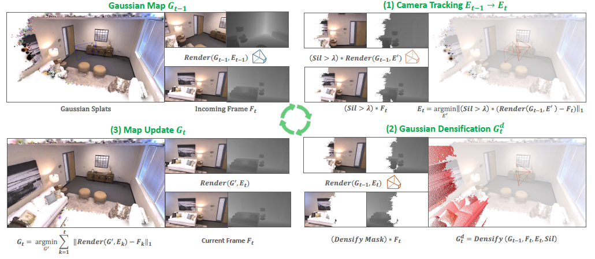
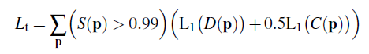
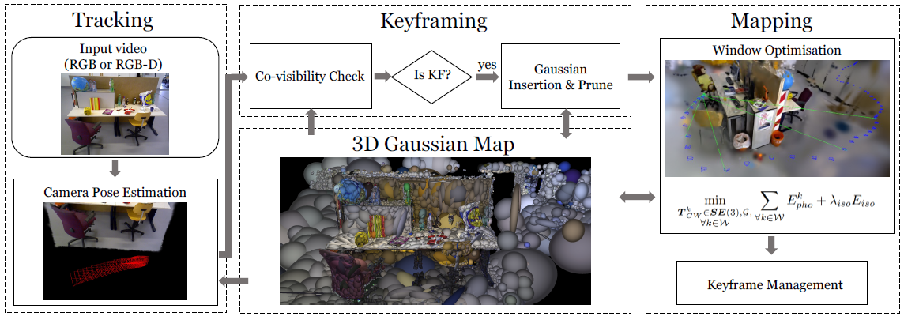
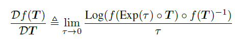
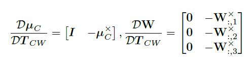
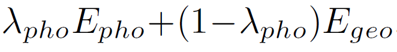
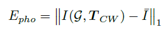
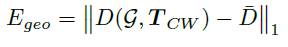
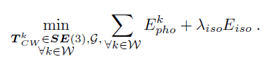
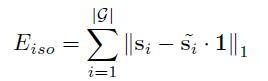

# 3D-GS-paper

## SplaTAM

### 论文框架：

Step (1) estimates the camera pose for the new image, using silhouette-guided differentiable rendering.
Step (2) increases the map capacity by adding new Gaussians based on the rendered silhouette and input depth. 
Step (3) updates the underlying Gaussian map with differentiable rendering.

### 论文创新点：

1. Fast rendering and dense optimization
2. Maps with explicit spatial extent
3. Direct optimization of scene parameters

**其实是使用了类似光流法进行了位姿估计** ：具体估计公式 

### 论文现有缺点：

1. 在定位性能上依旧是稀疏特征点方法更好一些
2. 对运动模糊、大尺度噪声、侵略性旋转效果不好

### 代码地址：
https://github.com/spla-tam/SplaTAM

## Gaussian Splatting SLAM

### 论文框架：

仅使用 3D 高斯表示法，统一了 SLAM 的所有组件，包括追踪、地图构建、关键帧管理以及新视角合成。

### 论文创新点：

首先推导解析的相机姿态雅可比矩阵，使得相机姿态可以和场景几何一起优化；然后引入新高斯形状正则化，以保证几何一致性，这对增量重建非常重要。

1. 相机姿态估计的解析雅可比

2. tracking

光度：
几何:

3. mapping

几何一致：

### 论文现有缺点：

仅在房间尺度的场景下测试。对于真实世界场景，不可避免地存在轨迹偏移。可通过整合闭环模块到本文的方法中解决。

### 代码地址：

https://github.com/muskie82/MonoGS
